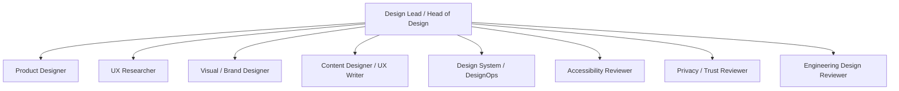

# Hana Design Organization

Hana のデザイン再構築は、見た目を一度きれいにする作業ではなく、子どもの写真と
親の感情を安心して残せる体験を継続的に判断する運営で進める。

この文書は、Hana のデザイン判断に必要な役割を定義する。レビューの入口条件・完了条件は
`docs/design/design-review-playbook.md`、Codex サブエージェント依頼文は
`docs/design/subagent-prompt-templates.md` を正とする。
評価基準の詳細は ISSUE-044、現行画面 inventory とロードマップは ISSUE-045 で扱う。

---

## 1. Operating Principles

| 原則                  | デザイン運営での意味                                                               |
| --------------------- | ---------------------------------------------------------------------------------- |
| 30秒で残せる          | 写真選択、AI生成、確認、保存の摩擦を増やす判断は必ず Product Design review に戻す  |
| 責めない              | 空白期間、失敗、未入力、離脱を責める文言・通知・強調表現を禁止する                 |
| Album, not feed       | 比較、人気、投稿、連続記録よりも、私的な記憶として見返せる密度を優先する           |
| Whisper, not shout    | 色、motion、CTA、empty state が親を急かさないかを Brand / Content 両方で見る       |
| AI is invisible       | AI をUI上の主役にしない。ただし写真送信・AI利用の同意は明示する                    |
| Privacy before polish | 子どもの写真、AI同意、削除、共有、エラー文言は見た目より先に trust risk を確認する |

---

## 2. Organization

Design Lead が最終判断を統合する。Codex ではメイン agent が Issue Captain としてこの役割を持ち、
サブエージェントは専門レビューを短命に行う。

---

## 3. Roles

| Role                         | 責務                                                              | 主な成果物                                      | 必須レビュー観点                                       |
| ---------------------------- | ----------------------------------------------------------------- | ----------------------------------------------- | ------------------------------------------------------ |
| Design Lead / Head of Design | デザイン方針、優先順位、レビュー結果の統合                        | Design decision note、Go / Hold / No-Go 判定    | Hana 原則との整合、Issue 分割、scope creep             |
| Product Designer             | 30秒記録フロー、画面構成、状態遷移、操作密度                      | Flow map、screen intent、interaction note       | 片手操作、入力最小化、保存までの摩擦                   |
| UX Researcher                | 親の利用状況、感情負荷、仮説と検証設計                            | Research question、assumption log               | post-bedtime、授乳中、復帰時、失敗時の心理             |
| Visual / Brand Designer      | 色、余白、写真の見せ方、motion、Hana らしい静けさ                 | Visual direction、token delta、motion note      | Album not feed、Whisper not shout、過度な装飾の排除    |
| Content Designer / UX Writer | 日本語文言、empty/error/success、AI の見せ方                      | Copy table、forbidden phrase check              | 責めない、断定しない、AI を押し出さない                |
| Design System / DesignOps    | token、component、spacing、review artifact の再利用性             | Component checklist、design debt log            | 一貫性、再利用、デザイン負債の記録                     |
| Accessibility Reviewer       | contrast、文字サイズ、tap target、focus、reduced motion、読み上げ | A11y checklist                                  | 44px hit area、7:1 body contrast、motion抑制、alt text |
| Privacy / Trust Reviewer     | 写真、AI同意、削除、共有、ログ証跡、実データ利用の不安            | Trust risk note、privacy gate result            | PII不使用、画像URL不記録、AI生成本文を証跡に残さない   |
| Engineering Design Reviewer  | Next.js 実装可能性、performance、API境界、testability、rollback   | Feasibility note、implementation split proposal | UI変更がAPI/DB/auth/imageへ波及しないか                |

---

## 4. Review Gates

| Phase                  | Entry 条件                                                    | 必須 reviewers                                      | Exit 条件                                                                 |
| ---------------------- | ------------------------------------------------------------- | --------------------------------------------------- | ------------------------------------------------------------------------- |
| Discovery / Framing    | Issue に目的、対象画面、やらないこと、privacy 前提がある      | Design Lead、UX Researcher、Privacy / Trust         | Go / Hold / No-Go と未検証仮説が残っている                                |
| Evaluation Design      | 評価対象と仮説が決まり、実データを使わない証跡方針がある      | Product Design、Content、Accessibility、Privacy     | 評価項目、判定基準、記録形式が揃う                                        |
| Screen Inventory       | 対象画面 / flow が列挙され、架空データで確認できる            | Product Design、Visual / Brand、Engineering         | 強み、課題、risk、後続 Issue 候補が半日から2日粒度で分かれる              |
| UI Implementation Plan | 実装対象が1 Issueに収まり、OpenAPI/API/DB 影響が判定済み      | Engineering、Design System、Accessibility、Privacy  | 変更範囲、test、manual QA、rollback がPR前に説明できる                    |
| PR Design Review       | PR が開き、スクリーンショットまたは確認手順がある             | 変更内容に応じた2名以上。privacy/image/AIは必須追加 | blocking finding がなく、未実施QAが historical ではなく future と明記済み |
| Release Check          | `pnpm pr:gate` と必要なQAが通り、未解決の人間判断が列挙される | Design Lead、Privacy / Trust、Engineering           | ready_to_merge / Hold / No-Go を記録する                                  |

---

## 5. Codex Subagent Operation

### 基本ルール

- 1 Issue につきメイン Codex が Issue Captain になる。
- サブエージェントは最大3名まで同時に動かす。
- サブエージェントは原則 read-only とし、編集・commit・PR作成は Issue Captain が行う。
- privacy / auth / image / AI / DB / release 判断は、人間確認が必要なら止める。
- サブエージェントの出力は「findings」「warnings」「next actions」に圧縮して PR に残す。

### 推奨ペルソナ

| Persona                       | 使うタイミング                        | 依頼すること                                              |
| ----------------------------- | ------------------------------------- | --------------------------------------------------------- |
| Head of Design Reviewer       | 方針決定、ロードマップ、PR最終前      | Hana 原則、優先順位、scope creep、10-star 体験からのズレ  |
| Product UX Reviewer           | flow / screen / navigation を変える時 | 30秒記録、片手操作、状態遷移、迷いと戻りやすさ            |
| Privacy / Trust Reviewer      | 写真、AI、削除、共有、error を扱う時  | 子ども情報への不安、同意、証跡、ログ、誤解を生む文言      |
| Accessibility Reviewer        | UI / component / motion を変える時    | hit area、contrast、focus、reduced motion、読み上げ       |
| Content / UX Writing Reviewer | empty / error / success / AI文言      | 責めない、断定しない、親へ圧をかけない、日本語の温度      |
| Visual / Brand Reviewer       | visual system / screen polish         | Album not feed、Whisper not shout、写真の余白、色とmotion |
| Engineering Design Reviewer   | 実装計画、PR review                   | Next.js実装可能性、test、performance、API境界、rollback   |

---

## 6. Subagent Prompt Templates

テンプレート本文の正本は `docs/design/subagent-prompt-templates.md` に置く。
この文書では persona と使い分けだけを定義し、PII / AI / image evidence の禁止事項を
二重管理しない。

---

## 7. Design Issue Sequence

1. ISSUE-043: 組織とサブエージェント運営を定義する。
2. ISSUE-044: Hana Design Evaluation Rubric と PR添付テンプレートを定義する。
3. ISSUE-045: 現行画面 inventory と再構築ロードマップを作る。
4. 後続 UI Issue: P0 / P1 / P2 に分け、1 Issue 1 PR で実装する。

ISSUE-044 と ISSUE-045 が終わるまで、大規模な画面刷新 PR は作らない。

---

## 8. Evidence Policy

レビュー証跡に残してよいもの:

- 画面名、flow 名、状態名
- 架空データのスクリーンショット
- 匿名化された観察メモ
- 評価カテゴリ、Go / Hold / No-Go、blocker / warning
- test command、PR番号、Issue番号

レビュー証跡に残さないもの:

- 子ども/親の氏名
- 画像 URL、signed URL、storage_key
- AI 生成本文そのもの
- request body、メールアドレス、生年月日
- 実ユーザーの写真や感情記録

実データでしか確認できない項目は、Issue を `blocked` または human QA として明示し、
Codex の自動実行では完了扱いにしない。
